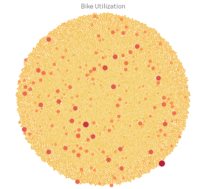
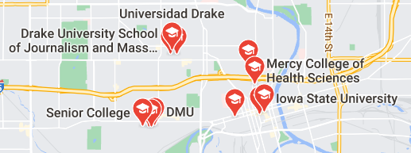

# Bikesharing

## Overview
The purpose of this analysis is to show to investors that a bike-sharing program in Des Moines is a solid business proposal. For that, we will analyse August 2019 New York City's data.

## Results
### Hourly Usage

We can observe from the plot, that most rides are between 3 and 9 hours with a peak of 5 hours.
### Hourly Usage by Gender

When deepdiving into the composition of the riders, we can clearly distinguish that the users are predominantly males and that the usage pattern of a peak of 5 hours is independent of the gender.
### Daily Usage by Hour
                                                                                                          
The heatmap makes it very easy to identify the hours with the most demand, 7-10 am and 5-8 pm. This makes sense since it's around the entry and exit time for most jobs and schools. This tells us that the clients are mostly office workers or students.
### Daily Usage by Hour by Gender

Again, we can see that there is no significant difference between males and female usage pattern, only that there are more males. This means that disregarding the gender, most of the clients seem to be office workers or students.
### Usertype

When comparing casual users, Customer, with recurring users, Subscriber, we can observe that the difference is abismal. 
gender and the day of te week makes no difference. This tells us that most clients are people commited to this type of vehicle.
### Customer Age per Gender

We can see that independent of the gender, the average trip duration tends to increase with the birth year. This means that most users are between 16-60 years olds with a peak between 16-23 years old, wich correspond to students and office workers.
### Most Common Locations
|Offices|Top Destinations           |Universities                          |
:-:|:--------------------------:|:-------------------------------------:
||

When comparing side by side the office buildings, most common destinations and the universities of New York City, we can see that there is a high correlation between them. This suggests, again, that most users are university students and office workers.
### Bike Utilization
                                                                                                        
Finally, the bike usage shows that few bikes have the most usage. This supports our previous analysis because it shows that most travels ocurr in a relative small area, mid and lower Manhattan, so this bikes stay in a busy area and are very used, while the other bikes are dispersed in New York City in areas where ther are fewer rides.
### Story
More details to this story could be find here:
[NYC Citybike Story](https://public.tableau.com/profile/gabriel7113#!/vizhome/NYC_Citibike_Challenge/NYCCitybikeStory)

## Summary
Based on the dataset, we have identified the client of New York City, students and office workers of mid and lower Manhattan. The next step is to find the corresponding users in Des Moines. When considering the concentration of universities, downtown Des Moines, seems to be a good canditate.
                                                                                                         
Using this same dataset, we could also visualize 
* Trip duration through the month.

* The amount of bikes needed per ride through the month.

We can see that there's a high correlation between the amount of rides per bike and the average trip duration. This makes sense, since the longer the rides, the more bikes are needed because more bikes are occupied.